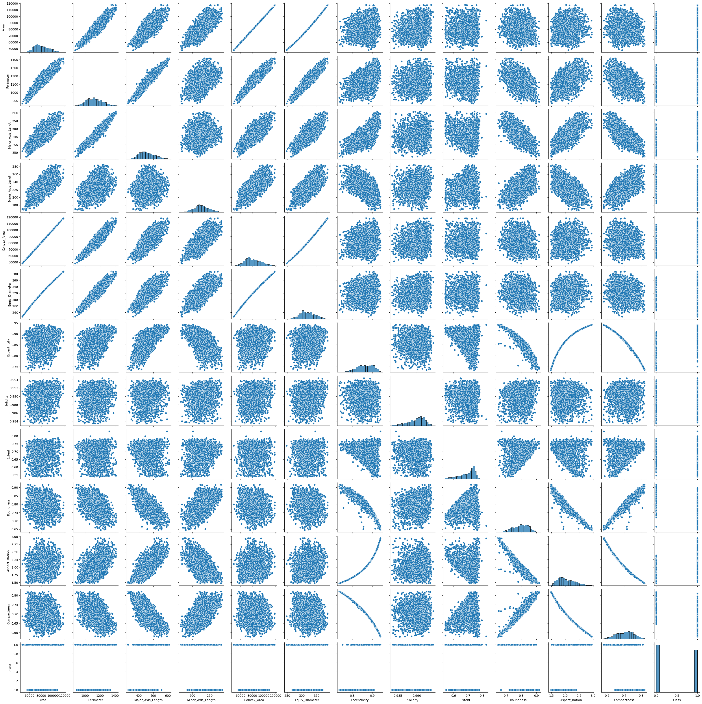
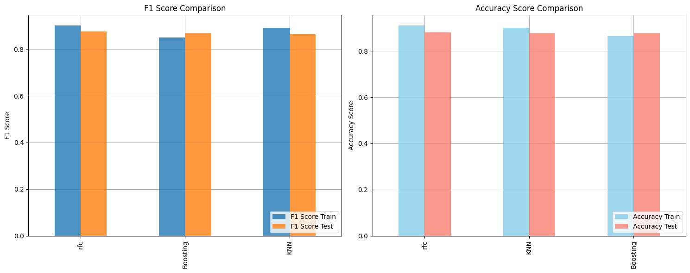

# Laporan Proyek Machine Learning - Moch. Avin

## Domain Proyek

Biji labu sering dikonsumsi sebagai camilan di seluruh dunia karena kandungan protein, lemak, karbohidrat, dan mineral. Mereka menyatakan bahwa biji labu dibagi menjadi banyak jenis, dan dua jenis yang paling penting dan berkualitas adalah Ürgüp Sivrisi dan Çerçevelik, yang ditanam di Turki.

Masalah yang akan diangkat adalah mengklasifikasikan dua jenis biji labu, Ürgüp Sivrisi dan Çerçevelik, berdasarkan ciri-ciri morfologi yang diekstrak dari gambar. Masalah ini penting untuk mengidentifikasi biji labu kuning, yang dapat membantu meningkatkan kemurnian varietas, meningkatkan hasil panen, dan menjaga kualitas labu.

Dalam artikel berjudul “Evaluation of solubility of pumpkin seed globulins by response surface method” yang diterbitkan oleh [J Food Eng](https://www.sciencedirect.com/science/article/pii/S0260877407003913?via%3Dihub), _Pumpkin seeds are considered as important for human health because it contains 37 percent of carbohydrate, 35 percent to 40 percent of fat and protein along with calcium, potassium, phosphorus, magnesium, iron, and zinc_.

> Masalah ini harus diselasaikan agar dapat meningkatkan efisiensi dan efektivitas dalam rangka meningkatkan kemurnian varietas, meningkatkan hasil panen, dan menjaga kualitas labu. Masalah ini dapat diselesaikan dengan cara membangun model _Machine Learning_ berkaitan kasus klasifikasi, dengan targetnya adalah kategori benihnya dan prediktornya seperti luas, soliditas, rasio aspek dsb.

Referensi yang di gunakan :

- [The use of machine learning methods in classification of pumpkin seeds (Cucurbita pepo L.)](https://link.springer.com/article/10.1007/s10722-021-01226-0)
- [Machine Learning Terapan, Dicoding](https://www.dicoding.com/academies/319/corridor)

## Business Understanding

### 1. Problem Statements

- Terdapat kebutuhan untuk mengklasifikasi biji labu antara varietas Ürgüp Sivrisi dan Çerçevelik, yang memiliki kemiripan fisik yang tinggi namun perbedaan genetik yang signifikan.
- Tidak adanya sistem yang efisien dan akurat dalam mengklasifikasi biji labu antara Ürgüp Sivrisi dan Çerçevelik secara otomatis dapat menghambat proses pengelolaan dan pengembangan varietas tanaman labu yang optimal.

### 2. Goals

- mengembangkan model klasifikasi yang mampu membedakan antara biji labu varietas Ürgüp Sivrisi dan Çerçevelik dengan tingkat akurasi yang tinggi, sehingga dapat mendukung para peneliti dalam memilih dan mengelola benih dengan tepat.
- Menciptakan solusi yang efektif dalam mengidentifikasi varietas biji labu secara cepat dan akurat, sehingga dapat meningkatkan efisiensi dan produktivitas dalam pengelolaan sumber daya tanaman serta membantu para peneliti dalam mengembangkan varietas yang lebih unggul dan adaptif.

  ### Solution statements

  Kita akan mengajukan 3 solution statement. Pertama, kita akan mencoba membangun model **K-Nearest Neighbor (KNN)** dengan mengatur parameter yang ada. Kedua, kita akan mencoba membangun model **Random Forest Classifier** dengan mengatur berbagai parameter yang ada. Ketiga, kita akan membangun model **AdaBoosting** dengan mengatur berbagai parameter yang ada. Ketiga solusi ini akan diukur deng metrik yang sama yaitu _f1 score_. F1 score digunakan karena memberikan gambaran yang seimbang antara _presisi_ dan _recall_ dalam satu nilai, memudahkan evaluasi kinerja model klasifikasi secara komprehensif.

### 3. Metrik

Metrik yang akan digunakan untuk mengevaluasi seberapa baik model dalam mengklasifikasikan biji labu adalah metrik **F1 score**. _F1 score_ mengukur keseimbangan antara _presisi_ dan _recall_ dalam klasifikasi. Pengembangan model akan melibatkan beberapa algoritma machine learning, seperti K-Nearest Neighbor, Random Forest, dan Boosting Algorithm. Dari ketiga model ini, akan dipilih satu model yang memiliki _F1 score_ tertinggi. Dengan demikian, kita bertujuan untuk menciptakan model klasifikasi yang paling akurat, yaitu model dengan _F1 score_ sebesar mungkin.

Untuk membangun model prediktif menggunakan machine learning, kita tentu memerlukan data. Dataset yang akan digunakan pada praktik kali ini adalah [Pumpkin Seeds Dataset](https://www.kaggle.com/datasets/muratkokludataset/pumpkin-seeds-dataset/)

## Data Understanding

Dataset yang kita gunakan awalnya terdiri dari 2500 baris dan 13 kolom dengan judul [Pumpkin Seeds Dataset](https://www.kaggle.com/datasets/muratkokludataset/pumpkin-seeds-dataset/).

Pada projek kita terdapat beberapa tahapan untuk memahami data :

#### 1. Deskripsi Variabel

- `Area`: Luas area
- `Perimeter`: Keliling
- `Major_Axis_Length`: Panjang sumbu utama
- `Minor_Axis_Length`: Panjang sumbu minor
- `Convex_Area`: Luas konveks
- `Equiv_Diameter`: Diameter
- `Eccentricity`: Eksentrisitas
- `Solidity`: Soliditas
- `Extent`: Ekstensi
- `Roundness`: Kebulatan
- `Aspect_Ration`: Rasio aspek
- `Compactness`: Kepadatan
- `Class`: Kelas Çerçevelik atau Kelas Ürgüp Sivrisi

#### 2. Mengecek Ringkasan Data

Tahapan ini dilakukan agar kita dapat mendapatkan gambaran data secara umum. Di sini terlihat baris data, fitur yang ada, standar deviasi, dsb.

#### 3. Mengecek _Missing Value_

Tahapan ini dilakukan agar setiap data yang akan diolah sudah dalam kondisi lengkap. Pada kasus ini tidak terdapat nilai yang kosong (_missing value_) sehingga kita dapat ke tahap selanjutnya.

#### 4. Mengecek Keseimbangan Data

Tahapan ini mengecek keseimbangan data, dan memastikan bahwa tidak terjadi ketidakseimbangan antara kedua kelas biji labu agar model yang dihasilkan tidak mengalami kecenderungan prediksi kelas tertentu. pada kasus ini tidak terjadi ketidakseimbangan data sehingga tidak perlu diproses lebih lanjut.

#### 5. Mengecek dan Menangani _Outliers_

Tahapan ini dilakukan agar meningkatkan performa model karena nilai yang sangat berbeda dari kumpulan data (_Outliers_) cenderung berpengaruh dalam pelatihan model. Kita menggunakan metode **IQR** sehingga nilai yang lebih kecil dari `Q1 - 1.5*IQR` dan lebih besar dari `Q3+1.5*IQR` merupakan nilai _Outlier_. Setelah membuang nilai _outlier_ data kita berubah dari 2500 baris dan 13 kolom menjadi 2285 baris dan 13 kolom.

#### 6. Exploratory Data Analysis - Multivariate Analysis

Dengan mengamati Correlation Matrix dan Pairplot di `.ipynb`, kita memperoleh insight sebagai berikut:

**Pairplot**

**Correlation Matrix**

- `Area`, `Convex_Area`, `Equiv_Diameter`, `Solidity` berkolerasi lemah terhadap `Class` secara positif
- `Perimeter`, `Major_Axis_Length` berkolerasi sedang terhadap `Class` secara positif
- `Eccentricity`, `Aspect_Ration` berkolerasi kuat terhadap `Class` secara positif
- `Extent` berkolerasi lemah terhadap `Class` secara negatif
- `Minor_Axis_Length` berkolerasi sedang terhadap `Class` secara negatif
- `Roundness`, `Compactness` berkolerasi kuat terhadap `Class` secara negatif

## Data Preparation

### 1. Pembersihan Data: Menghapus Kolom yang Redundan

_Data Cleaning_ dengan menghapus kolom-kolom yang diidentifikasi sebagai redundant dalam DataFrame. Kolom yang dihapus adalah 'Convex_Area' dan 'Equiv_Diameter' karena keduanya dianggap sangat mirip dengan kolom 'Area'. Ini membantu menyederhanakan dataset dan mengurangi kelebihan fitur yang mungkin tidak diperlukan dalam analisis berikutnya.

### 2. Train-Test-Split

Train-Test-Split yaitu membagi dataset menjadi data train dan data test diperlukan untuk menguji seberapa baik model dapat menggeneralisasi data baru. Fungsi train_test_split() dari library sklearn digunakan untuk membagi dataset. Pada proses ini, kita membagi dataset dengan rasio 80 20, yang berarti 80% (1828 baris data) akan digunakan untuk melatih model dan 20% (457 baris data) akan digunakan untuk menguji model.

### 3. Standarisasi

Standarisasi adalah proses penting dalam persiapan data untuk algoritma machine learning. Tujuannya adalah untuk menghasilkan data dengan skala relatif serupa atau mendekati distribusi normal, sehingga algoritma machine learning dapat memiliki performa yang lebih baik dan konvergen lebih cepat.

Dalam proses standarisasi, kita tidak akan menggunakan teknik seperti one-hot-encoding yang biasanya digunakan untuk fitur kategorikal. Sebaliknya, kita akan menggunakan teknik StandarScaler yang tersedia dalam library Scikit-learn. Ini akan membantu dalam mengubah fitur-fitur numerik sehingga memiliki mean 0 dan varians 1.

Melalui standarisasi, kita membuat data lebih mudah diolah oleh algoritma machine learning, memungkinkan mereka untuk bekerja lebih efisien dan menghasilkan hasil yang lebih baik.

## Modeling

### 1. Model Development dengan K-Nearest Neighbor (KNN)

KNN memanfaatkan konsep "kesamaan fitur" untuk memprediksi nilai setiap data baru berdasarkan kemiripannya dengan titik data dalam set pelatihan. Dengan menggunakan algoritma ini, kita menentukan prediksi berdasarkan k-neighbors terdekat dari data baru. KNN adalah pendekatan sederhana namun efektif dalam berbagai kasus, menawarkan kemudahan interpretasi dan penerapan yang luas dalam pemodelan data terstruktur.

Parameter yang digunakan pada proses pemodelan adalah menentukan parameter k (jumlah data terdekat) `n_neighbors=5`.

### 2. Model Development dengan Random Forest

Random Forest adalah algoritma pembelajaran mesin yang kuat dan serbaguna yang memanfaatkan teknik ensemble dengan cara membangun sejumlah besar pohon keputusan selama pelatihan. Setiap pohon keputusan dalam Random Forest diberi bobot dan keputusan akhir diambil berdasarkan mayoritas suara dari semua pohon. Pendekatan ensemble ini membantu mengurangi overfitting dan meningkatkan ketahanan model terhadap noise dalam data, membuatnya cocok untuk berbagai macam masalah klasifikasi dan regresi.

Parameter yang digunakan pada proses pemodelan :

- `max_depth`: Mengatur kedalaman maksimum dari setiap pohon dalam Random Forest. Semakin tinggi nilainya, semakin kompleks modelnya, tetapi terlalu tinggi dapat menyebabkan overfitting.

- `max_features`: Menentukan jumlah fitur yang akan dipertimbangkan oleh setiap pohon saat mencari pemisahan yang optimal. Ini membantu mengurangi overfitting dengan membatasi variasi antar pohon.

- `random_state`: Mengontrol keacakan dalam pembangunan model. Dengan menetapkan nilai yang sama, Anda dapat mendapatkan hasil yang konsisten dari setiap eksekusi model. Ideal untuk tujuan reproduktibilitas dan perbandingan model.

## 3. Model Development dengan Boosting Algorithm

Boosting adalah teknik di machine learning di mana model lemah digunakan secara berulang dan ditingkatkan untuk membuat model yang lebih kuat. Model lemah ini fokus pada kesalahan sebelumnya dan diberi bobot lebih besar untuk memperbaikinya. Dengan cara ini, Boosting meningkatkan performa model secara bertahap, menjadikannya efektif untuk menangani masalah klasifikasi atau regresi yang kompleks. Di sini digunakan AdaBoost.

Parameter yang digunakan pada proses pemodelan :

- `learning_rate`: Mengatur seberapa besar setiap model lemah dalam ensemble "belajar" dari kesalahan sebelumnya. Semakin kecil nilai learning_rate, semakin lambat pembelajaran model.

- `random_state`: Mengontrol keacakan dalam pembangunan model. Dengan menetapkan nilai yang sama, Anda dapat memastikan hasil yang konsisten dari satu eksekusi ke eksekusi lainnya.

### Model Yang Dipilih

Kita memilih model **Random Forest** karena secara performa lebih baik dibandingkan kedua model lainnya pada kasus kita ini. Performa yang digunakan adalah _F1 Score_. Cenderung performa model **Random Forest** memberikan solusi terbaik bagi kasus kita karena baik train dan testing memiliki performa lebih baik.

## Evaluation

F1 score adalah metrik evaluasi klasifikasi yang mengukur presisi (precision) dan recall secara bersamaan. F1 score merupakan rata-rata harmonis dari presisi dan recall, yang memberikan bobot yang sama kepada kedua metrik tersebut. F1 score berguna saat kita ingin mencapai keseimbangan antara presisi dan recall.

Formula F1 Score:
$$F1 = 2 \times \frac{precision \times recall}{precision + recall}$$

Presisi (precision) adalah jumlah true positive dibagi dengan jumlah true positive ditambah false positive. Presisi mengukur seberapa banyak dari kasus positif yang terprediksi benar oleh model.

$$Precision = \frac{TP}{TP + FP}$$

Recall (recall), juga dikenal sebagai sensitivity atau true positive rate, adalah jumlah true positive dibagi dengan jumlah true positive ditambah false negative. Recall mengukur seberapa banyak dari kasus positif yang diprediksi dengan benar oleh model.

$$Recall = \frac{TP}{TP + FN}$$

Dalam konteks klasifikasi, True Positive (TP) adalah jumlah kasus positif yang diprediksi dengan benar, False Positive (FP) adalah jumlah kasus negatif yang salah diprediksi sebagai positif, dan False Negative (FN) adalah jumlah kasus positif yang salah diprediksi sebagai negatif.

F1 score memberikan ukuran yang baik tentang kinerja model klasifikasi ketika kelas target tidak seimbang atau ketika biaya kesalahan false positives dan false negatives tidak simetris. Misalnya, dalam kasus di mana kita lebih peduli dengan false negatives daripada false positives atau sebaliknya.

Jadi, F1 score adalah metrik evaluasi klasifikasi yang baik untuk kasus di mana kita ingin memperhatikan keseimbangan antara presisi dan recall.

Berikut hasil peroleh F1 score setiap model :
| Model | Train | Test |
|-----------|---------|---------|
| KNN | 0.892709| 0.864734|
| RFC | 0.901629| 0.875 |
| Boosting | 0.850935| 0.867925|

Berikut gambar bar chart perbandingan nilai F1 score :

Berikut sample hasil prediksi model kita dalam bentuk tabel :
| y_true | prediksi_KNN | prediksi_rfc | prediksi_Boosting |
|--------|--------------|--------------|-------------------|
| 804 | 0.0 | 0.0 | 0.0 |
| 743 | 0.0 | 0.0 | 1.0 |
| 315 | 0.0 | 0.0 | 0.0 |
| 1994 | 1.0 | 1.0 | 1.0 |
| 248 | 0.0 | 1.0 | 1.0 |
| 1297 | 0.0 | 0.0 | 0.0 |
| 2310 | 1.0 | 0.0 | 1.0 |
| 2478 | 1.0 | 1.0 | 1.0 |
| 697 | 0.0 | 0.0 | 0.0 |
| 1584 | 1.0 | 1.0 | 1.0 |

Berdasarkan tabel dan chart nilai F1 score cenderung model **Random Forest** lebih baik dari kedua algoritma lainnya.

## Conclusion

Dalam proyek ini, penulis telah menyelesaikan serangkaian tahapan yang penting. Penulis memulai dengan memahami domain proyek dan kasus bisnis yang ingin diselesaikan. Setelah itu, penulis menyelami data yang tersedia, menyiapkan dataset, melakukan proses pemodelan, dan mengevaluasi hasilnya. Penulis berhasil menyelesaikan tantangan bisnis yang dihadapi dan mencapai tujuan dengan membangun 3 model yang berbeda. Dari ketiga model tersebut, penulis memilih model `Random Forest` sebagai solusi terbaik untuk masalah yang dihadapi.
